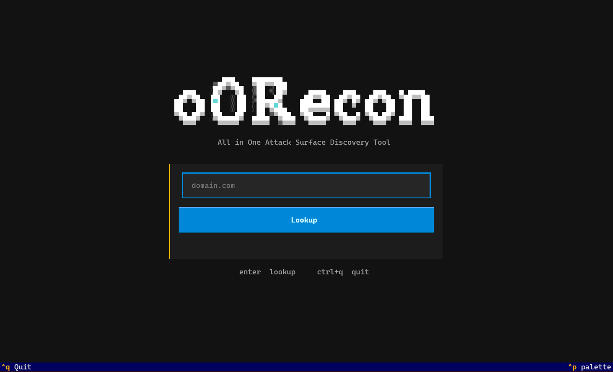

# oORecon — Attack Surface Discovery TUI



**oORecon** is an open-source **Python terminal UI** for **web reconnaissance** and **attack surface discovery**. It helps **bug bounty hunters**, **penetration testers**, and **OSINT** researchers map a domain quickly: **DNS recon**, **subdomain enumeration**, **port scanning**, **reverse IP lookup**, **leaked login URLs**, plus per-host **sitemap**, **directory brute-force**, and **JavaScript endpoint / secret mining**.

If you are looking for an **all-in-one recon TUI** instead of chaining many CLIs, oORecon runs the main checks one after another after you enter an apex domain.


## Disclaimer

This is AI slop. Every line was generated by an AI, and none of it was typed by hand — there wasn't time for that. Treat the code as machine output and use it anyway.


## Table of contents

- [Disclaimer](#disclaimer)
- [What is oORecon?](#what-is-oorecon)
- [Who is it for?](#who-is-it-for)
- [Features](#features)
- [Quick start](#quick-start)
- [How to use](#how-to-use)
- [Why oORecon?](#why-oorecon)
- [Project structure](#project-structure)
- [FAQ](#faq)
- [Legal / ethics](#legal--ethics)
- [Credits & dependencies](#credits--dependencies)

## What is oORecon?

oORecon is a **Textual-based TUI** that turns a single domain into a live recon dashboard. On lookup it:

1. Resolves **DNS records** (A, AAAA, NS, MX, SOA, and related)
2. Runs **reverse IP** against the domain’s DNS **A / AAAA** addresses
3. Fetches **leaked login / credential URLs** for the domain (read-only)
4. Scans a large **port set** against the looked-up domain
5. Enumerates **subdomains from certificate transparency** and probes HTTPS

Open any live host to continue with **content discovery** (sitemaps, directories) and **JavaScript analysis** (endpoints, URLs, and likely secrets with neighbor context).

Domain input is normalized automatically: `https://`, paths, ports, and leading `www.` are stripped so you always work from the **apex domain**.

## Who is it for?

- **Bug bounty** recon when you want one screen for DNS + subdomains + ports + leaks
- **Pentest** attack-surface mapping before deeper exploitation
- **OSINT** and asset inventory for a brand or apex domain
- Researchers who prefer a **keyboard-driven TUI** over a stack of disconnected tools

## Features

### Domain reconnaissance (main menu)


| Module                                      | What it does                                                                      |
| ------------------------------------------- | --------------------------------------------------------------------------------- |
| **[DNS recon](#dns-recon)**                 | Resolve **A**, **AAAA**, **NS**, **MX**, **SOA** and related DNS records          |
| **[Subdomain finder](#subdomain-finder)**   | Certificate-transparency names + **HTTPS alive check** (Chrome TLS impersonation) |
| **[Port scanner](#port-scanner)**           | Large port set against the target domain                                          |
| **[Reverse IP lookup](#reverse-ip-lookup)** | Shared-host discovery from DNS **A / AAAA**                                       |
| **[Leaked Login URL](#leaked-login-url)**   | Stealer-log style login / credential URLs (read-only)                             |


#### DNS recon

Shows the looked-up domain’s DNS surface in one board so you can see exposed IPs and mail/name infrastructure before scanning further.

#### Subdomain finder

Pulls certificate names for the apex, then checks each host over HTTPS. Filter by status class (2xx / 3xx / 4xx / 5xx / down) or by **host prefix** (`mixrank.com` matches only hosts that start with that string).

#### Port scanner

Runs a broad port pass on the domain you entered (not every subdomain) and lists open ports with service / banner detail.

#### Reverse IP lookup

Takes only the apex DNS **A** and **AAAA** addresses and looks up related certificate hostnames. Does not fan out to every subdomain IP.

#### Leaked Login URL

Lists leaked login-related URLs tied to the domain. The table is **read-only** (no click-through).

### Host workspace (per subdomain / host)


| Tool                                                | What it does                                                                           |
| --------------------------------------------------- | -------------------------------------------------------------------------------------- |
| **[Sitemap crawler](#sitemap-crawler)**             | `robots.txt` + **XML sitemaps** (`.xml` / `.xml.gz`)                                   |
| **[Directory brute-force](#directory-brute-force)** | Content discovery with a SecLists-style wordlist                                       |
| **[JS Miner](#js-miner)**                           | Endpoints and URLs from JavaScript; secret-like findings with match + neighbor context |


#### Sitemap crawler

Discovers sitemap endpoints from robots and common paths, then follows nested sitemap indexes. Only confirmed XML sitemap URLs are shown.

#### Directory brute-force

Bruteforces common paths against the host. Useful for admin panels, backups, and forgotten endpoints.

#### JS Miner

Fetches page scripts, extracts URLs/endpoints, and scans script bodies for likely API keys and secrets. **script / endpoint / url** rows are list-only; other kinds open a detail window with the match and surrounding characters.

## Quick start

```bash
pip install -r requirements.txt
python main.py
```

Pass a domain on the CLI:

```bash
python main.py example.com
```

**Requires:** Python 3.10+

**Controls:** `Ctrl+Q` quit · `Esc` back · `Enter` open host / secret detail · `/` filter subdomains

## How to use

1. Launch oORecon and enter an apex domain (or paste a full URL — it will be normalized).
2. Wait for parallel jobs: DNS, subdomains, ports, reverse IP, leaked URLs.
3. Use the main tabs to review results; filter subdomains as needed.
4. Press **Enter** on a live host to open the host workspace.
5. Run the host pipeline (sitemap → directories → JS miner) or each tool alone.
6. On JS Miner, open non-URL findings to inspect match + context before acting.

## Why oORecon?

- **All-in-one recon TUI** — DNS, CT subdomains, ports, reverse IP, and leak URLs without juggling five CLIs
- **Browser-grade HTTP to targets** — Chrome TLS impersonation reduces simple fingerprint blocks
- **Secret + endpoint mining** — harvest URLs from JS and review likely credentials with surrounding context
- **Session host cache** — reopening a host in the same run restores prior tool results
- **Keyboard-first workflow** — designed for speed during live recon sessions

## Project structure

```
main.py                 Entrypoint
ui/app.py               Recon dashboard (lookup order lives here)
ui/phases/              DNS, reverse IP, leaked URLs, ports, subdomains
ui/workspace.py         Per-host sitemap / dirs / JS miner
ui/styles.py            Dashboard CSS
ui/format.py            DNS board and status cell rendering
models.py               Shared result models
utils.py                Domain normalize, curl_cffi thread sessions
tools/                  One module per recon tool (dnsinfo, certsub, ports, …)
requirements.txt        Python dependencies
assets/                 Banner (oorecon.png) and demo GIF
```

## FAQ

### Is oORecon a subdomain enumeration tool?

Yes. The **Subdomain** tab enumerates names from certificate transparency and checks which hosts respond over HTTPS. It is one module inside a broader attack-surface TUI.

### Does oORecon replace Amass / Subfinder / ffuf?

No. Those tools are excellent specialists. oORecon aims to be a **fast interactive dashboard** that covers DNS, CT subdomains, ports, reverse IP, leaks, and host-level content/JS recon in one place.

### Can I paste a full URL?

Yes. Inputs like `https://www.example.com/path` are normalized to the apex `example.com`.

### Does reverse IP scan every subdomain IP?

No. Reverse IP uses only the looked-up domain’s DNS **A** and **AAAA** records.

### Are leaked login URLs clickable?

No. That table is read-only by design.

### How does JS secret detection avoid noise in minified bundles?

High-entropy “random string” style detectors are disabled for JS mining. Findings that look like keys/tokens can be opened to show the match plus neighboring source text so you can verify false positives yourself.

### Is unauthorized scanning allowed?

No. Only test systems you have permission to assess.

## Legal / ethicsq

Only scan domains and hosts you are **authorized** to test. Unauthorized scanning or credential abuse may be illegal.

## Credits & dependencies

Data sources and libraries used by oORecon (not affiliated):


| Component               | Credit                                                                                                                  |
| ----------------------- | ----------------------------------------------------------------------------------------------------------------------- |
| Certificate names       | [crt.name](https://crt.name)                                                                                            |
| Reverse IP / cert hosts | [Hurricane Electric BGP Toolkit](https://bgp.he.net) (`bgp.he.net`)                                                     |
| Leaked login URLs       | [Hudson Rock](https://www.hudsonrock.com)                                                                               |
| JS URL patterns         | Inspired by [JSFinder](https://github.com/Threezh1/JSFinder) / [LinkFinder](https://github.com/GerbenJavado/LinkFinder) |
| JS secret detection     | [Yelp detect-secrets](https://github.com/Yelp/detect-secrets)                                                           |
| Directory wordlist      | SecLists-style `common.txt`                                                                                             |
| TUI                     | [Textual](https://textual.textualize.io/)                                                                               |
| Target HTTP             | [curl_cffi](https://github.com/lexiforest/curl_cffi)                                                                    |
| API HTTP                | [aiohttp](https://docs.aiohttp.org/)                                                                                    |
| DNS                     | [dnspython](https://www.dnspython.org/)                                                                                 |


